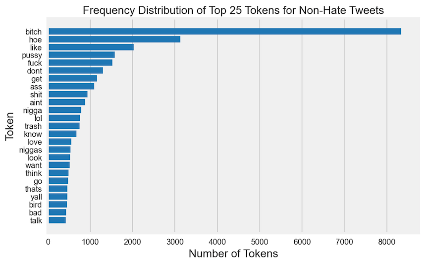
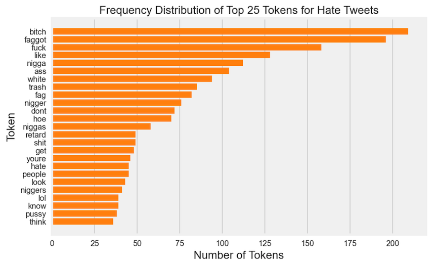
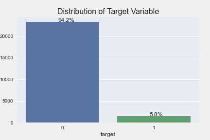

<h1>
Developing a Hate Tweet Detector
</h1>

**Author:**  Steven Yan

*This project builds off of my joint project with Ivan Zarharchuk,  Twitter-Sentiment-Analysis, located <a href="https://github.com/datascisteven/Twitter-Sentiment-Analysis">here</a>.*  

# Flask App Screenshots

# Introduction:

Why should we care about regulating or detecting hate speech in the first place?  All democracies are in agreement that hate speech that incites violence or harm towards another group should be prohibited.  For Americans, who believe in the fundamental right to freedom of speech as afforded by the Constitution, regulating hate speech that is degrading of groups of people has not been and cannot be regulated. A recent NYU study from 2019 has found a direct link between the number of racist tweets and real-life hate crimes in 100 US cities, and Twitter has been hugely criticized for being complacent in curbing hate speech on their platform.  Democracies around the world take much more stringent measures against curbing hate speech than the United States because laws criminalizing such speech would violate the guarantee to the rights afforded to its citizens by the 1st Amendment.  Recent events have demonstrated how words have the power to incite others violence, namely the insurrection against one of our own institutions at the Capital on January 6th.  We have also seen the recent rise in Asian-American hate crime throughout the nation culminating in the Atlanta shooting due to the incessant invocation of words associating COVID with China like "Kung-flu" or "Chinavirus" by our top officials.

# Business Understanding

In Facebook's Community Standards Enforcement Report 4th Quarter 2020, it was reported that 97% of hate speech was preemeptively detected and taken down before any human flagging.  This is an increase from 94% in the 3rd quarter and 80.5% in 2019.  In terms of prevalence, as of early 2021, only 5 or 6 out of 10,000 views contained any violating content as per Facebook's guidelines.  96.8% of hate content is found via Facebook's AI algorithm as of the beginning of 2021, an increase from 89.2% in the beginning of 2020, 68.7% 2019, and 38% 2018.

What is shocking is the amount of hate content Facebook has taken action on over the years: 2.5M at the beginning of 2018, 4M 2019, 9.5M 2020, and a whopping 25.2M at the beginning of 2021.

A key challenge in the automated detection of hate speech is differentiating between hate speech and offensive language. Hate speech is defined as public speech that expresses hate, disparages, or incites or encourages violence against another individual or group based on some characteristic such as race, gender, religious belief, sexual orientation, etc.  Even that exact definition can differ from region to region or country to country.  It is essential that we recognize that even the same hate or derogatory word can have or  and definitely from context to context. Even the ever-pervasive 4 letter f-word easily demonstrates this ambiguity:  "f@!k the (insert ethnic group), they need to go back where they came from" vs. "fuck my life and everyone in it, i work so hard but get no where. #f@!&mylife". In the former, the word is used to express hate towards an ethnic group, but in the latter, it is more of an expression of when things don't go right or how you would have expected it to.  If you look at the word f****t,the derogatory term for homosexuals, reclaiming the word from its more negative connotation into an expression of playfulness even pride has been an important step in their personal identity journey.

Sparked by the alarming nature of recent events, social media platforms have already implemented algorithms to regulate or remove hate tweets, and having the ability to differentiate between hate versus non-hate is an integral part of any model.

# Data Sources:

**Davidson Dataset:**

This is the original dataset I started with due to its availability with the actual text of the hate tweets.  I wanted to start working on the project ahead of getting approved for the Twitter developer account. 

The Davidson Dataset contains 24,802 tweets with 5.77% labeled as hate, 77.43% as offensive, and 16.80% as Neutral using crowdsourcing for annotating the tweets into the 3 classes. 

**Aristotle University Dataset:**

This dataset was collected to investigate large scale crowdsourcing and characterization of Twitter abusive behavior.  There were four categories of tweets identified: normal, spam, abusive and hateful.  I subsetted the hateful tweets to add 3635 more instances of the minority class.  The dataset contains tweet ID numbers to allow us to use Twitter API to download the tweet text and metadata.

**University of Copenhagen Dataset:**

This dataset was collected to investigate predictive features for hate speech detection on Twitter.  There were 3 categories of tweets:  sexism, racism, and none.  I subsetted the sexism and racism tweets to add 5347 instances of the minority class.

**HASOC 2019 Dataset:**

This HASOC or Hate Speech and Offensive Content dataset was part of a multinational effort to faciliate hate tweet detection through achine learning in other Indo-European langauges since most of the work has been conducted in English.  There were datasets collected in Hindi and German.

# Data Understanding:

What are the challenges in dealing with tweets:

Inconsistent use of grammar, proper spelling, punctuation, and capitalization
Repetition of same ch1aracter, and use of random abbreviations makes tokenization and POS tagging difficult
Use of special characters, i.e. emojis, emoticons, hashtags

*Here are the visualizations for the top 25 tokens for training hate and non-hate tweets:*

 

Some of the top words in the negative class are: 'bitch', 'hoe', 'pussy', 'fuck', 'nigga', 'shit', and 'ass', but all those mentioned with some in lesser frequency are represented also in the positive class. It appears 'bitch' may often be used for offensive or neutral tweets than hate tweets. No single sexist epithet is used exclusively to espouse sexism.   

'bitch' appears in a much greater proportion in non-hate tweets in over 8000 tweets out of 17514 tweets versus just over 200 out of 1072 tweets. 'trash' appears in non-hate subset without 'white', but 'white' and 'trash' appears in somewhat equal proportion in the hate subset.

The following words, 'nigger(s)', 'white' ('trash'), 'retard', 'queer', 'gay', 'fag' and 'faggot', 'hate' are almost exclusively in the positive class.

These visualizations further illustrate the strong overlap of the words that appears in both datasets and demonstrate the importance of vectorizing the tweets with representations other than Bag of Words, which consists of a collection of unigrams or singular words. It is unable to capture phrases and multiword expressions

*Here is the initial target variable distribution with the Davidson dataset with 23353 non-hate tweets and 1430 hate tweets.*

I incorporated additional minority class tweets from three additional dataset: Aristotle University, University of Copenhagen, and HASOC 2019.  I looked for diversity in choosing the dataset to increase the generalizability of the model.
  
# Modeling:

I selected these six following algorithms for my vanilla model based on models in my vanilla based on the papers I was reviewing prior to undergoing this project:

Logistic Regression serves as my baseline algorithm in all my classification models.  Both Naive Bayes and SVM are commonly used algorithms in the text classification sphere. 

*With Unbalanced Dataset:*

1. Multinomial Naive Bayes
2. Random Forest
3. Logistic Regression
4. Support Vector Machine
5. Adaboost Classifier
6. Gradient Boost Classifier
7. Resampling Techniques
   - Random Under Sampler
   - Condensed Nearest Neighbour
   - SMOTE-ENN

*With More Balanced Dataset:*

8.  Same 6 base algorithms
9.  Doc2Vec DBOW
10. Doc2Vec DMM
11. Neural Networks (Coming soon...)

The new balanced dataset contained 23353 non-hate tweets and 11784 hate tweets.

# Results:

With the balanced dataset, at a baseline accuracy of 78%, the best models (Random Forest, Logistic Regression, and SVM) improved accuracy to around 92%. In terms of other metrics, they exhibited the highest F1 scores at around 87-88%, but do not have the highest recall or precision scores.  They also have the highest ROC-AUC scores at around 96% and PR-AUC scores at around 95%.

# Next Steps:

- Exploring additional models that involve word embeddings, Doc2Vec, Word2Vec, Gensim, GloVe
- Applying neural networks for classification (CNN)
- Exploring using SpaCy for deploying model

# Folder Structure:

	├── README.md            	        <- the top-level README for reviewers of this project
	├── _notebooks      	            <- folder containing all the project notebooks
	│   ├── balanced_modeling.ipynb		<- notebook for modeling with balanced dataset
    │   ├── balanced.ipynb              <- notebook for developing more balanced dataset
    │   ├── flask.ipynb                 <- notebook for setup to deploy on Flask
	│   ├── modeling_advanced.ipynb	 	<- notebook for implementing more advanced NLP techniques
	│   ├── modeling.ipynb           	<- notebook for modeling with original dataset and resampling methods
	│   ├── preprocessing.ipynb      	<- notebook for models with dataset post-augmentations
	│   └── twitter_api.ipynb        	<- py file with self-defined functions
	├── Final_Notebook.ipynb         	<- final notebook for project
	├── _data                        	<- folder of csv files (csv)
	│   ├── _metrics                 	<- folder containing metrics dataframes
	│   └── _original                	<- folder containing original datasets
	├── _images                      	<- folder containing visualizations
	├── _pickle    			 	        <- folder of pickle files 
	└── _py				 	            <- folder containing py files

# Contact Information:

<strong>
Steven Yan
</strong>

 **Email:**  [stevenyan@uchicago.edu][1]

 **LinkedIn:**   [https://www.linkedin.com/in/datascisteven][2]

 **Github:**  [https://www.github.com/datascisteven][3]

# References:

Davidson, T., Warmsley, D., Macy, M., & Weber, I. (2017). Automated Hate Speech Detection and the Problem of Offensive Language. ICWSM.  https://arxiv.org/pdf/1703.04009.pdf

Founta, A., Djouvas, C., Chatzakou, D., Leontiadis, I., Blackburn, J., Stringhini, G., Vakali, A., Sirivianos, M., & Kourtellis, N. (2018). Large Scale Crowdsourcing and Characterization of Twitter Abusive Behavior. ArXiv, abs/1802.00393. https://arxiv.org/pdf/1802.00393.pdf

Waseem, Z., & Hovy, D. (2016). Hateful Symbols or Hateful People? Predictive Features for Hate Speech Detection on Twitter. SRW@HLT-NAACL. https://www.aclweb.org/anthology/N16-2013.pdf

Mandl, T., Modha, S., Majumder, P., Patel, D., Dave, M., Mandalia, C., & Patel, A. (2019). Overview of the HASOC track at FIRE 2019: Hate Speech and Offensive Content Identification in Indo-European Languages. Proceedings of the 11th Forum for Information Retrieval Evaluation. http://ceur-ws.org/Vol-2517/T3-1.pdf

Aristotle University Dataset:  Founta, A., Djouvas, C., Chatzakou, D., Leontiadis, I., Blackburn, J., Stringhini, G., Vakali, A., Sirivianos, M. and Kourtellis, N., 2018. Large Scale Crowdsourcing and Characterization of Twitter Abusive Behavior \[Data file\]. ArXiv. Retrieved from: https://dataverse.mpi-sws.org/dataset.xhtml?persistentId=doi:10.5072/FK2/ZDTEMN

University of Copenhagen Dataset:  Waseem, Z., Hovy, D. (2016). Hateful Symbols or Hateful People? Predictive Features for Hate Speech Detection on Twitter \[Data file\]. In: *Proceedings of the NAACL Student Research Workshop*. San Diego, Calfornia: Association for Computational Linguistics, pages 88-93. Retrieved from: https://github.com/ZeerakW/hatespeech.

Facebook's Community Standards Enforcement Report (Q1 2021 Report): https://transparency.fb.com/data/community-standards-enforcement/?from=https%3A%2F%2Ftransparency.facebook.com%2Fcommunity-standards-enforcement

[1]:	mailto:stevenyan@uchicago.edu
[2]:	https://www.linkedin.com/in/datascisteven
[3]:	https://www.github.com/datascisteven
